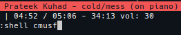
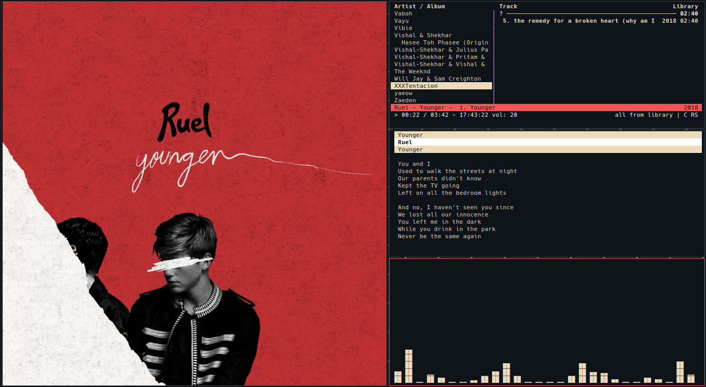

`cmusf` is a shell script that displays media cover/art when you play songs inside the cmus music player and launches the cava music visualiser..

## Dependencies

- feh (to view image)
- ffmpeg (to fetch art from music file)
- cava (music visualiser)
- grep and sed

## Usage

   1. 
   ```bash
   cp cmusf /usr/bin
   ```
  > Note: Add /usr/bin/ in PATH if its not added already or copy cmusf into a 
  other directory which is in path.

2. You can start the script from cmus!
Just enter `:shell cmusf` inside cmus, and you should be good to go.`



## Screenshot


